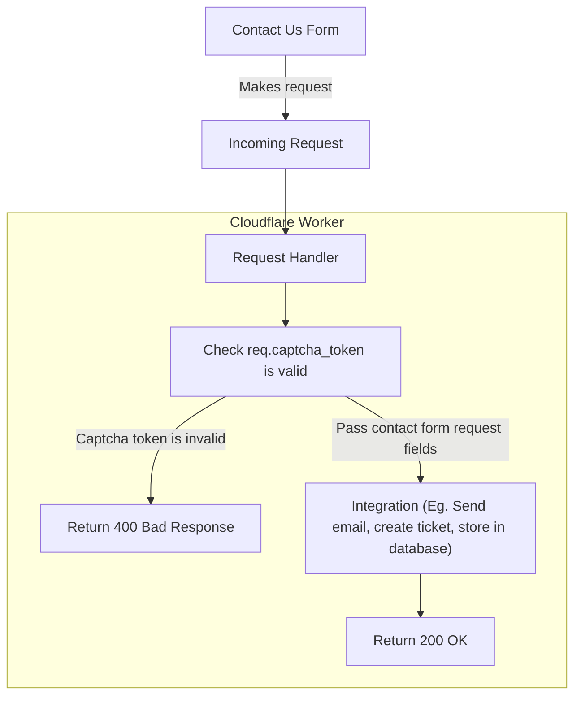

# Initial Design

## Diagram

*[Can't see the diagram? Click here to view in browser.](https://mermaid-js.github.io/mermaid-live-editor/)*

This will be used for the 'Contact Us' form on Tigress. It is a simple form that collects the following:
- First Name
- Last Name
- Email
- Message Type
    - From a list stored front end, no validation needed for message type
- Message
    - Minimum of X characters
- Captcha
    - Captcha to validate that the request came from a human
- Honeypot Field
    - Invisible field to be sent in the request, basically if this value is not empty/null then this was filled in by a bot.

This form will send an email with the form information to a configured email.
- Eventually, will have the ability to pick and choose between email or Jira/Trello/Notion
    - This is a simple API, it's very basic and shouldn't change much in the future other than the storage solution

### Spam
- Validate each request using HCaptcha
- Use the honeypot field

### Testing
- This is a very simple thing, so just manual tests :eyes:

### Configuration

Configured using environment variables, or add secrets in `wranger.toml`

### Deployment
- Deployments are pretty easy with Cloudflare Workers
    - Have instructions in [RUNBOOK.md](../runbook/RUNBOOK.md) for manual deployments, but favour pipeline deploying on pushes to master

#### Secrets Storage
- Use GitHub Secrets

### Metrics
- Since this uses Cloudflare Workers, we get status code metrics out of the box.
    - Can see the amount of requests, 200s, 400s, ...
    - So this will get put into Mr. Ping

### Logging
- Not interested in keeping logs for failed/successful requests, again we get the metrics out of the box.
- Errors should be sent to Sentry
